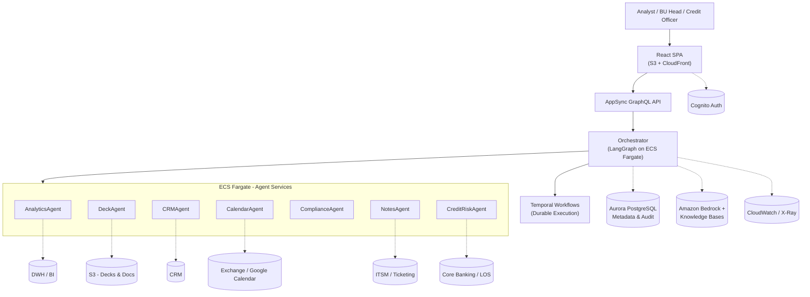

# Atlas – BFSI Agentic Orchestrator

> An enterprise-grade, multi-agent orchestrator for BFSI QBR & credit-review workflows, built on AWS with LangGraph, Temporal, and Amazon Bedrock.

---

## Problem

In banking and financial services, recurring review workflows like **quarterly business reviews (QBRs)** and **credit committee packs** are still orchestrated manually across email, calendars, spreadsheets, BI dashboards, CRM, and core systems. Analysts and portfolio managers spend days:

- Pulling KPIs and risk indicators from data warehouses and BI tools  
- Re-creating the same PowerPoint decks every quarter  
- Chasing stakeholders across CRM, HR hierarchies, and Outlook calendars  
- Manually documenting decisions and action items for audit

Research on generative AI in knowledge-work and consulting tasks shows 25–40% productivity gains and higher quality when AI is embedded in task execution, not just used as a chatbot. Enterprise agentic platforms are starting to automate **multi-step, multi-system workflows** with orchestrated AI agents, especially in domains like HR, CRM, operations, and BFSI.

**Atlas** is a reference implementation of such a platform, focused specifically on BFSI review workflows.

---

## What Atlas Does

Atlas implements a **manager–worker multi-agent system** for two flagship workflows:

### 1. QBR / Q3 Review Pack Orchestrator

- Pulls KPIs from a data warehouse / BI  
- Generates a draft deck and executive summary using approved templates  
- Identifies stakeholders from CRM / HR hierarchies  
- Proposes and schedules meetings, sends pre-reads  
- Tracks comments, approvals, and post-meeting actions

### 2. Credit Committee Review Pack Orchestrator

- Retrieves borrower exposure, collateral, risk ratings, covenant status  
- Generates a credit pack for committee review  
- Identifies mandatory committee members and observers  
- Schedules the review, circulates materials, and captures decisions/actions

Both workflows are designed around **human-in-the-loop, policy-aware automation** suitable for regulated BFSI environments.

---
## High-Level Architecture

Atlas is opinionated on **AWS** and uses **LangGraph** and **Temporal** to orchestrate multi-agent workflows, following patterns from AWS's multi-agent LangGraph guidance and other production examples.



---

## Tech Stack

**Cloud (AWS)**  
- **Amazon S3 + CloudFront** – host the React SPA and static assets  
- **Amazon Cognito** – user authentication (analysts, managers, PMO)  
- **AWS AppSync** – GraphQL API for goal submission and workflow monitoring (or API Gateway for REST)  
- **Amazon ECS Fargate** – runs orchestrator and agent microservices as containers  
- **Aurora PostgreSQL** – workflow metadata, KPI cache, stakeholder mappings, audit logs  
- **Amazon Bedrock** – LLMs (e.g., Claude 3 series) + Knowledge Bases for RAG over policies, templates, prior decks and minutes  
- **Amazon CloudWatch + AWS X-Ray** – logs, metrics, end-to-end workflow tracing  
- **AWS KMS & IAM** – encryption and least-privilege access

**Orchestration & AI**  
- **LangGraph** – graph-based multi-agent orchestration (StateGraph, conditional branches)  
- **Temporal** – durable workflows for long-running QBR / credit processes  
- **Python 3.12 + FastAPI** – orchestrator and agents  
- **OpenTelemetry** – instrumentation of traces and metrics  

**Frontend**  
- **React + TypeScript**  
- **MUI or Chakra UI** – UI components  
- **Apollo Client** – GraphQL client for AppSync  

---
## Agents and Responsibilities

Atlas uses specialized agents, each owning a narrow capability:

- **AnalyticsAgent**  
  - Pulls KPIs and risk metrics from DWH/BI (e.g., revenue, NIM, NPL, churn, utilization)  
  - Computes variances vs plan and flags anomalies  
  - Attaches data lineage metadata (source system/table, as-of date)

- **DeckAgent**  
  - Uses templates and branding to generate PowerPoint (or HTML/Markdown) decks  
  - Produces executive summaries for email and meeting pre-reads  
  - Highlights low-confidence sections for human review

- **CRMAgent**  
  - Identifies stakeholders based on BU, segment, account portfolio, and CRM/HR hierarchies  
  - Suggests mandatory vs optional attendees with rationale

- **CalendarAgent**  
  - Reads calendars, proposes time slots, creates events  
  - Sends pre-read invites and reminders

- **CreditRiskAgent**  
  - Fetches exposure, collateral, risk ratings, covenants from LOS/core banking  
  - Surfaces policy breaches or unusual risk patterns for committee attention

- **ComplianceAgent**  
  - Checks generated content against policies (wording guidelines, PII restrictions, regulatory language)  
  - Enforces allow/deny rules for specific actions (e.g., external email sending)

- **NotesAgent**  
  - Ingests meeting notes / transcripts  
  - Extracts decisions, actions, owners, and due dates  
  - Opens or updates tickets/tasks in ITSM / Kanban systems

---

## Key Features

- **End-to-end workflow graphs**  
  - Explicit LangGraph state machines define each step, branch, and approval in QBR and credit workflows (not just prompt chains).

- **Durable execution**  
  - Temporal workflows ensure QBR and credit workflows survive restarts, retries, and long suspensions (e.g., waiting for approvals).

- **Shared RAG for BFSI knowledge**  
  - Bedrock Knowledge Bases index policies, templates, historical decks, and minutes; all agents query the same governed source of truth.

- **Governance & auditability**  
  - Every agent action is logged with actor, principal, inputs, outputs, and decisions  
  - Human approvals and overrides are first-class events, supporting regulated BFSI needs

- **Human-in-the-loop by design**  
  - Decks, attendee lists, and scheduled meetings always go through human confirmation in the demo configuration (no \"fully autonomous\" mode)

---
## Project Structure

> Planned layout – some directories may be stubs in the initial version.

```text
atlas-bfsi-agentic-orchestrator/
  README.md

  frontend/
    src/
    public/

  services/
    orchestrator/
      src/
      tests/
    agents/
      analytics/
      deck/
      crm/
      calendar/
      compliance/
      credit_risk/
      notes/

  infra/
    cdk/
      bin/
      lib/
      cdk.json

  docs/
    01-product-vision.md
    02-bfsi-use-cases.md
    03-system-design.md
    04-data-contracts.md
    05-security-compliance.md
    06-adoption-playbook.md

  design/
    q3-pack-orchestrator.md
    credit-committee-orchestrator.md
    sequence-diagrams.md

  playbooks/
    runbook-q3-pack.md
    runbook-credit-review.md
```

---

## Getting Started (Local Simulation)

> The full cloud deployment uses AWS CDK and Temporal, but you can run a local simulation first.

1. **Clone the repo**

   ```bash
   git clone https://github.com/Steja28/atlas-bfsi-agentic-orchestrator.git
   cd atlas-bfsi-agentic-orchestrator
   ```

2. **Set up Python environment**

   ```bash
   python -m venv .venv
   source .venv/bin/activate  # or .venv\\Scripts\\activate on Windows
   pip install -r services/orchestrator/requirements.txt
   ```

3. **Run local LangGraph demo**

   ```bash
   cd services/orchestrator
   uvicorn main:app --reload
   ```

4. **Trigger a workflow (Q3 pack)**  
   - POST to `/workflows/q3-review-pack` with a JSON body like:

   ```json
   {
     \"bu_id\": \"retail_lending\",
     \"quarter\": \"2026Q3\",
     \"due_date\": \"2026-10-05\"
   }
   ```

5. Inspect logs and state transitions in the console or UI (to be added).

Cloud deployment instructions (CDK stack, ECS, AppSync, Aurora, Bedrock) live in `docs/03-system-design.md` and `infra/cdk/` once those are pushed.

---

## Roadmap

- [ ] Implement local-only LangGraph workflows for QBR  
- [ ] Add Temporal integration for durable execution  
- [ ] Add Bedrock + Knowledge Bases integration for RAG  
- [ ] Implement minimal React UI for workflow creation + monitoring  
- [ ] Add credit committee workflow and CreditRiskAgent  
- [ ] Harden compliance & audit modules for BFSI scenarios  
- [ ] Publish design docs and adoption playbook

---

## Contributing

Contributions are welcome! Please open an issue or submit a pull request with your improvements.

## License

MIT License - see LICENSE file for details.
